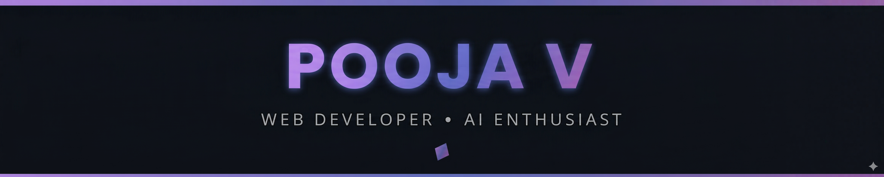
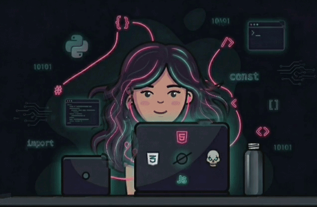
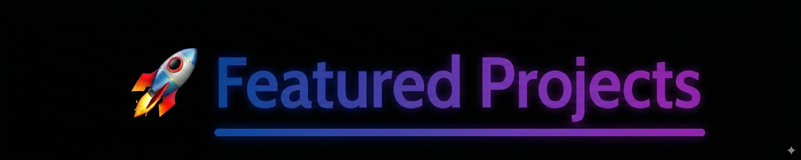
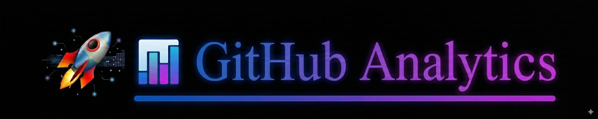

  
   
   

  

  
  

  

---

<table border="0" style="border-collapse: collapse; background-color: rgba(13, 17, 23, 0.85); border-radius: 20px; border: 2px solid rgba(157, 114, 233, 0.4); box-shadow: 0 0 25px rgba(157, 114, 233, 0.2); backdrop-filter: blur(5px);">
  <tr>
    

<table border="0" style="border-collapse: collapse; background-color: rgba(13, 17, 23, 0.85); border-radius: 20px; border: 2px solid rgba(157, 114, 233, 0.4); box-shadow: 0 0 25px rgba(157, 114, 233, 0.2); backdrop-filter: blur(5px);">
  <tr>
    <td width="60%" style="padding: 30px; border: none; vertical-align: top;">
      

- 🌱**Learning:** Building expertise in Java Full-Stack Development with Spring Boot and React,

- 👀 Interested in Open Source and Web Development

- 💞️ Looking to collaborate on react js, Java, APIs, and Web Apps

- 📫 Reach me: poojavelm@gmail.com

 </tr>
</table>

 

  

---

 

---

 

  

---

  
  
  
  

---

